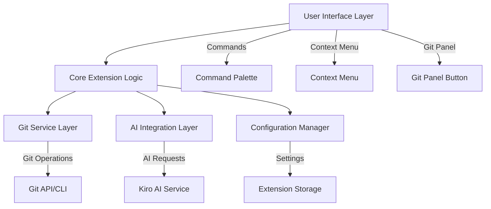
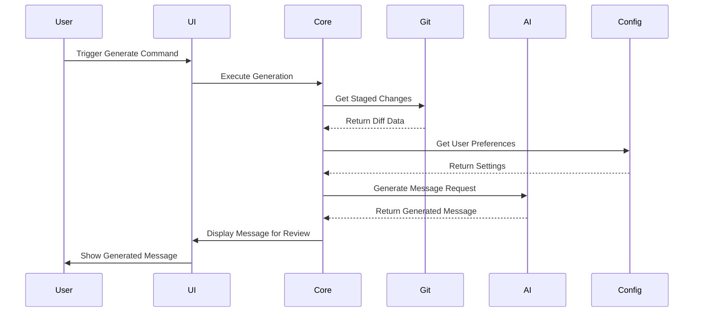

# Design Document

## Overview

The Git Commit Message Generator is a Kiro IDE extension that leverages AI to automatically generate intelligent, conventional commit messages based on staged git changes. The extension integrates seamlessly with Kiro's existing git functionality and AI model selection system, providing multiple user interfaces for commit message generation while maintaining extensibility through configuration options.

## Architecture

### High-Level Architecture



### Component Interaction Flow



## Components and Interfaces

### 1. Extension Entry Point

- **Purpose**: Main extension activation and registration
- **Responsibilities**:
  - Register commands, context menus, and UI elements
  - Initialize core services
  - Handle extension lifecycle events
- **Key Methods**:
  - `activate(context)`: Extension activation
  - `deactivate()`: Cleanup on deactivation

### 2. User Interface Components

#### Command Palette Integration

- **Command ID**: `git-commit-generator.generate`
- **Title**: "Generate Git Commit Message"
- **Keybinding**: Configurable (default: Ctrl+Shift+G)

#### Context Menu Integration

- **Location**: Git panel right-click menu
- **Label**: "Generate Commit Message"
- **Condition**: Only visible when staged changes exist

#### Source Control Panel Button

- **Location**: Right side of the commit message input field in the source control panel
- **Icon**: AI/magic wand icon
- **Tooltip**: "Generate commit message with AI"
- **Positioning**: Inline with the input field, similar to other action buttons

### 3. Core Generation Engine

#### CommitMessageGenerator Class

```typescript
interface CommitMessageGenerator {
  generateMessage(options: GenerationOptions): Promise<CommitMessage>;
  validateStagedChanges(): Promise<boolean>;
  analyzeChanges(diff: GitDiff): ChangeAnalysis;
}

interface GenerationOptions {
  includeScope: boolean;
  commitType?: string;
  customTemplate?: string;
  maxLength: number;
}

interface CommitMessage {
  subject: string;
  body?: string;
  type: string;
  scope?: string;
  isConventional: boolean;
}
```

#### Change Analysis Engine

- **Purpose**: Analyze git diff to understand change context
- **Capabilities**:
  - File type detection
  - Change magnitude assessment
  - Commit type inference
  - Scope determination

### 4. Git Service Layer

#### GitService Class

```typescript
interface GitService {
  getStagedChanges(): Promise<GitDiff>;
  getRepositoryStatus(): Promise<RepoStatus>;
  isValidRepository(): Promise<boolean>;
  getConflictStatus(): Promise<ConflictInfo>;
}

interface GitDiff {
  files: ChangedFile[];
  additions: number;
  deletions: number;
  summary: string;
}

interface ChangedFile {
  path: string;
  status: "added" | "modified" | "deleted" | "renamed";
  additions: number;
  deletions: number;
  diff: string;
}
```

### 5. AI Integration Layer

#### AIService Class

```typescript
interface AIService {
  getCurrentModel(): Promise<AIModel>;
  generateCommitMessage(
    prompt: string,
    context: ChangeContext
  ): Promise<string>;
  isAvailable(): Promise<boolean>;
}

interface ChangeContext {
  diff: GitDiff;
  preferences: UserPreferences;
  projectContext?: ProjectInfo;
}
```

### 6. Configuration Manager

#### Settings Schema

```json
{
  "commitMessageGenerator": {
    "enableConventionalCommits": true,
    "customCommitTypes": [
      "feat",
      "fix",
      "docs",
      "style",
      "refactor",
      "test",
      "chore"
    ],
    "includeScope": true,
    "maxSubjectLength": 50,
    "customTemplates": {},
    "analysisFeatures": {
      "fileTypeAnalysis": true,
      "changeImpactAnalysis": true,
      "scopeInference": true
    }
  }
}
```

## Data Models

### Core Data Structures

#### CommitAnalysis

```typescript
interface CommitAnalysis {
  suggestedType: CommitType;
  suggestedScope?: string;
  changeDescription: string;
  impactLevel: "minor" | "moderate" | "major";
  affectedAreas: string[];
  confidence: number;
}

enum CommitType {
  FEAT = "feat",
  FIX = "fix",
  DOCS = "docs",
  STYLE = "style",
  REFACTOR = "refactor",
  TEST = "test",
  CHORE = "chore",
}
```

#### UserPreferences

```typescript
interface UserPreferences {
  commitStyle: "conventional" | "custom";
  includeBody: boolean;
  customTypes: CommitType[];
  templates: Record<string, string>;
  analysisSettings: AnalysisSettings;
}

interface AnalysisSettings {
  enableFileTypeAnalysis: boolean;
  enableScopeInference: boolean;
  enableImpactAnalysis: boolean;
}
```

## Error Handling

### Error Categories and Responses

#### Git-Related Errors

- **No Repository**: Display user-friendly message with suggestion to initialize git
- **No Staged Changes**: Prompt user to stage changes before generating
- **Merge Conflicts**: Detect and provide appropriate messaging for conflict resolution

#### AI Service Errors

- **Service Unavailable**: Fallback to basic template-based generation
- **Rate Limiting**: Queue requests and inform user of delays
- **Invalid Response**: Retry with simplified prompt or use fallback

#### Configuration Errors

- **Invalid Settings**: Reset to defaults with user notification
- **Missing Templates**: Use built-in defaults

### Error Recovery Strategies

```typescript
interface ErrorHandler {
  handleGitError(error: GitError): Promise<ErrorResponse>;
  handleAIError(error: AIError): Promise<ErrorResponse>;
  handleConfigError(error: ConfigError): Promise<ErrorResponse>;
}

interface ErrorResponse {
  canRecover: boolean;
  fallbackAction?: () => Promise<void>;
  userMessage: string;
  logLevel: "info" | "warn" | "error";
}
```

## Testing Strategy

### Unit Testing

- **Git Service**: Mock git operations and test diff parsing
- **AI Integration**: Mock AI responses and test prompt generation
- **Change Analysis**: Test commit type inference with various diff scenarios
- **Configuration**: Test settings validation and defaults

### Integration Testing

- **End-to-End Workflows**: Test complete generation flow from UI trigger to message display
- **Extension Lifecycle**: Test activation, deactivation, and command registration
- **Error Scenarios**: Test error handling and recovery mechanisms

### Test Data Sets

- **Sample Repositories**: Various project types with different change patterns
- **Diff Scenarios**: Single file, multiple files, different change types
- **Edge Cases**: Empty commits, large diffs, binary files

### Performance Testing

- **Large Repositories**: Test performance with repositories containing many files
- **Complex Diffs**: Measure generation time for large changesets
- **AI Response Times**: Monitor and optimize AI service integration

## Extension Packaging and Distribution

### Package Structure

```
git-commit-generator/
├── package.json
├── README.md
├── CHANGELOG.md
├── src/
│   ├── extension.ts
│   ├── services/
│   ├── ui/
│   └── utils/
├── resources/
│   └── icons/
├── test/
└── dist/
```

### Metadata Configuration

- **Extension ID**: `git-commit-generator`
- **Display Name**: "AI Git Commit Message Generator"
- **Category**: "Git", "AI Tools"
- **Keywords**: ["git", "commit", "ai", "automation"]
- **Minimum Kiro Version**: Latest stable

### Distribution Requirements

- **Packaging**: Standard Kiro extension format
- **Dependencies**: Minimal external dependencies
- **Size Optimization**: Bundle optimization for distribution
- **Documentation**: Comprehensive README and usage examples

## Security Considerations

### Data Privacy

- **Local Processing**: Minimize data sent to external services
- **Sensitive Information**: Filter out potential secrets from diffs
- **User Consent**: Clear disclosure of AI service usage

### Code Security

- **Input Validation**: Sanitize all git diff inputs
- **Command Injection**: Prevent injection through git commands
- **Extension Permissions**: Request minimal required permissions

## Performance Optimization

### Caching Strategy

- **Diff Caching**: Cache recent diff analysis results
- **AI Response Caching**: Cache similar commit message patterns
- **Configuration Caching**: Cache user preferences in memory

### Lazy Loading

- **Service Initialization**: Initialize services only when needed
- **UI Components**: Load UI elements on demand
- **Large Diff Handling**: Stream processing for large changesets

## Future Extensibility

### Plugin Architecture

- **Custom Analyzers**: Allow third-party change analysis plugins
- **Template System**: Extensible template engine for custom formats
- **AI Provider Integration**: Support for multiple AI service providers

### API Exposure

- **Public API**: Expose core functionality for other extensions
- **Event System**: Publish events for integration with other tools
- **Configuration API**: Allow programmatic configuration updates
